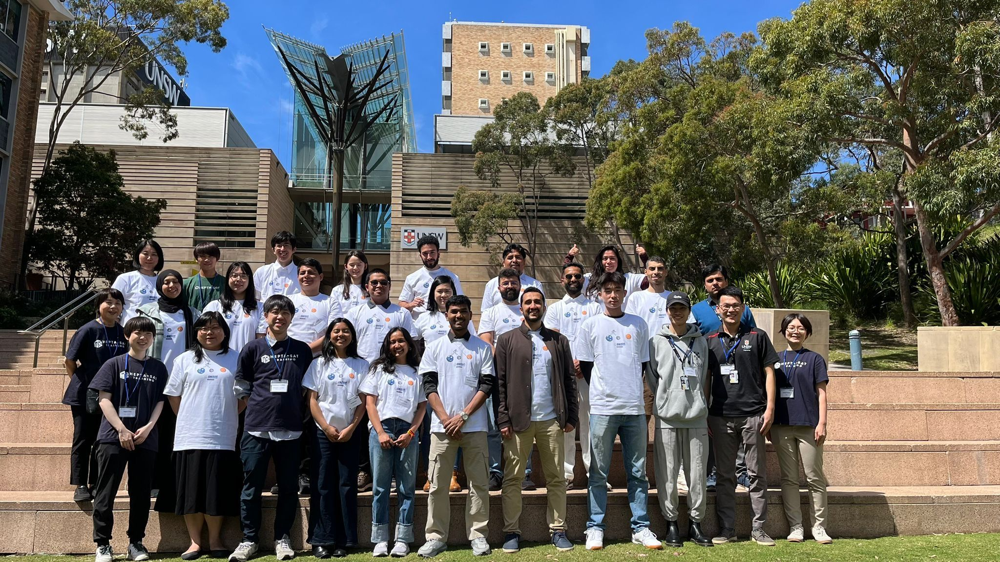

With the excitement still resonating from the Space Olympia – International Astronautical Congress, IAC 2025 Sydney, we were thrilled to host a CubeSat Training Workshop at our UNSW Kensington Campus. It was a pleasure to welcome participants from around the world to this one-day, hands-on event focused on understanding CubeSat systems, integration, and testing 🛰️🛰️🛰️. 

We extend our heartfelt thanks to our Japanese colleagues from UNISEC-Global, Professor Masahiko Yamazaki and his team, JAXA: Japan Aerospace Exploration Agency KIBO Academy and United Nations Office for Outer Space Affairs (UNOOSA) for their dedicated efforts in bringing this workshop to our campus.

A big shout-out to the UNSW Mechanical and Manufacturing Engineering and the UNSW Faculty of Engineering for their generous sponsorship and support. At UNSW, we are fully committed to the United Nations Sustainable Development Goals (SDGs) and continue to advocate for the use of advanced space technologies in Space Engineering Education and Research.

