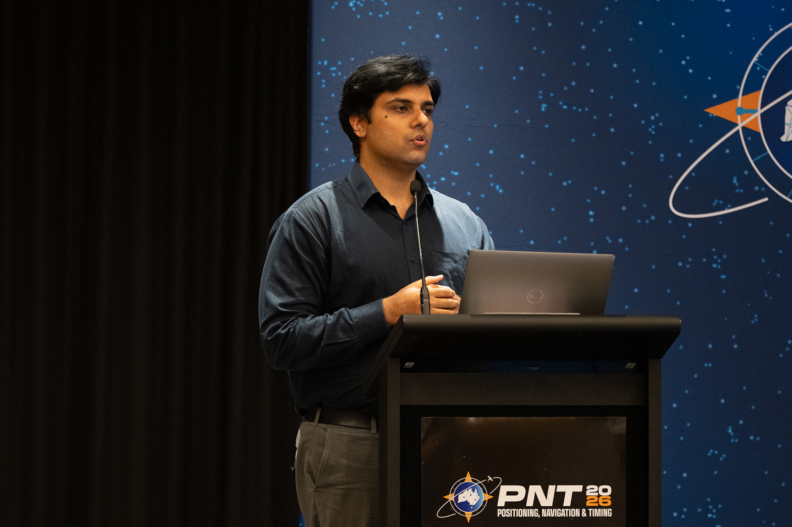
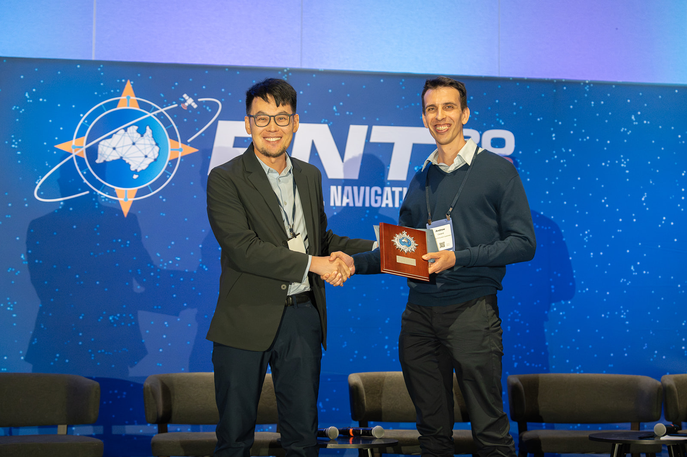

At **PNT 2026** in **Royal Randwick Racecourse**, organised by the **Australian Institute of Navigation**, my PhD student **Rameez Malik** and I presented in the **Lunar Navigation session on 5 February**.

Rameez presented his work on **GNSS Based Orbit Determination of Lunar Navigation Satellite System**.

On **6 February**, I coordinated the **Student Presentation Competition** as part of the organising committee.

Many congratulations to **Andrew Cleland** from **The University of Southern Queensland** for winning this award.

