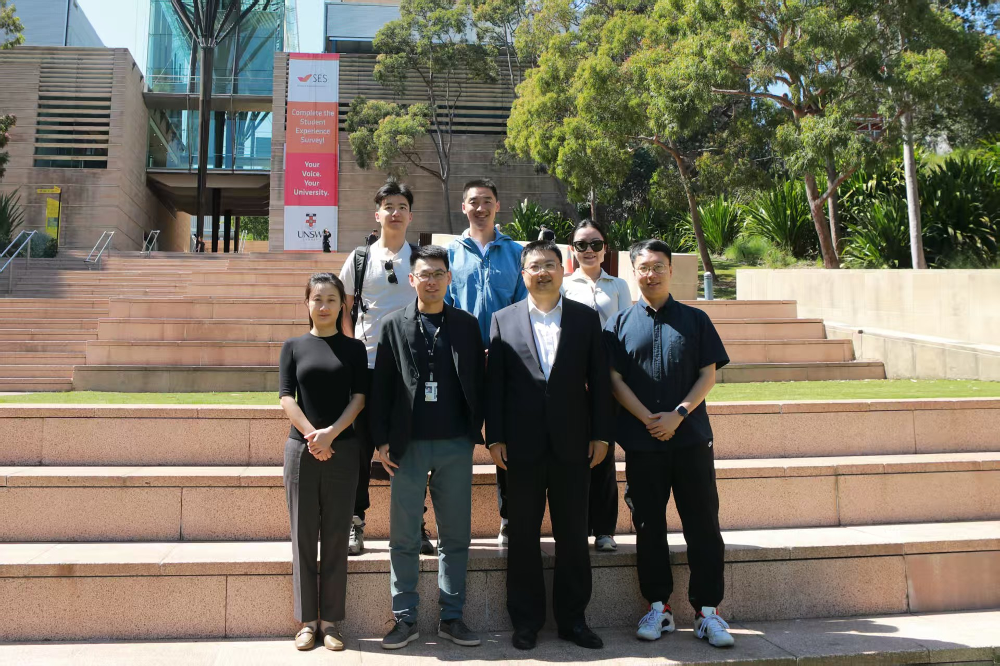

On 1 October 2025, Professor Zhaokui Wang and his colleagues from Tsinghua University visited UNSW Sydney. We exchanged ideas on new thermospheric density modelling techniques, low-Earth-orbit collision avoidance, and future opportunities for collaborative missions.

